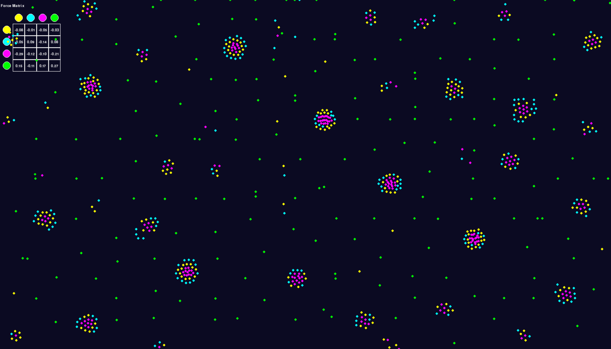
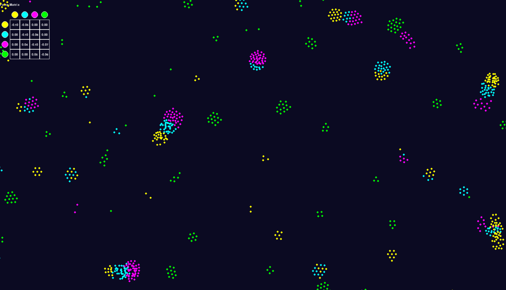
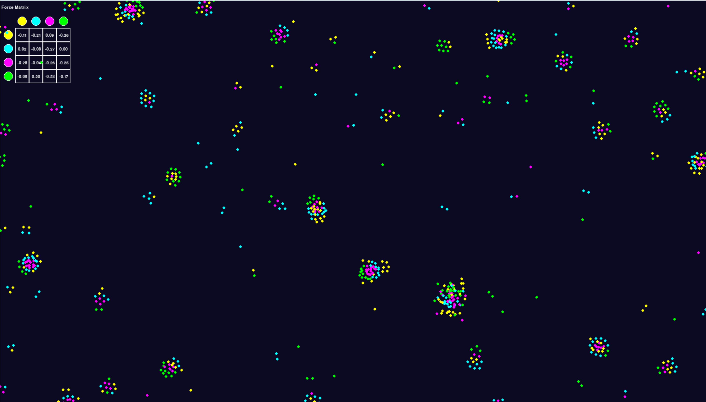

# Particle Life Simulation

Particle-based molecular-dynamics toy model: four species interact through a force matrix of attraction and repulsion. Simple pairwise rules produce collective, cell-like clusters.

This was written as a biophysics course project. The live simulation is in Pygame; screenshots and recordings from the original runs are in [`media/`](media/).

## Gallery

Cell-like clusters from a hand-tuned force matrix:



Snake-like chain formed under a different force matrix:



Force-matrix overlay during a live run:



- [Introduction](media/introduction.mp4)
- [Full simulation](media/particle_life.mp4)
- [Cluster formation](media/cluster_formation.mp4)

## Features

- Pairwise attraction–repulsion between four particle species
- Tunable or random force matrix
- Spatial partitioning so force updates stay interactive at hundreds of particles
- Periodic (wrap-around) boundaries
- Live force-matrix overlay

## Requirements

- Python 3.8+
- Pygame 2.0+

```bash
pip install -r requirements.txt
```

## Usage

```bash
python main.py
```

`particle_life.py` is a thin wrapper around the same entry point.

To try a random force matrix instead of the default cell-forming one:

```python
from particlelife.app import run
from particlelife.config import SimulationConfig

run(SimulationConfig.with_random_forces(seed=8))
```

## Layout

```
main.py                 # Pygame entry point
particle_life.py        # backward-compatible launcher
particlelife/
  config.py             # colors, distances, force matrix
  particle.py           # particle state and wrapping
  forces.py             # pairwise force law
  spatial.py            # grid used for neighbor search
  simulation.py         # time stepping
  render.py             # force-matrix overlay
  app.py                # event loop
media/                  # screenshots and recordings
```

## Configuration

Edit `particlelife/config.py` or pass a `SimulationConfig`:

| Parameter | Role |
| --- | --- |
| `width`, `height` | Window size |
| `num_particles` | Population |
| `particle_colors` | Species colors |
| `force_matrix` | Attraction (+) / repulsion (−) between species |
| `min_distance`, `max_distance` | Short-range core repulsion and interaction cutoff |
| `friction` | Velocity damping each step |
| `repulsive_force` | Extra push when particles overlap |
| `seed` | Reproducible initial positions |

Default force matrix (yellow, cyan, magenta, green):

```python
{
    YELLOW:  {YELLOW: -0.1, CYAN: -0.05, MAGENTA:  0.00, GREEN:  0.00},
    CYAN:    {YELLOW:  0.04, CYAN: -0.10, MAGENTA: -0.06, GREEN:  0.00},
    MAGENTA: {YELLOW:  0.00, CYAN:  0.05, MAGENTA: -0.10, GREEN: -0.07},
    GREEN:   {YELLOW:  0.00, CYAN:  0.00, MAGENTA:  0.06, GREEN: -0.10},
}
```

## Acknowledgements

Inspired by particle-life simulations and the emergent behavior of interacting particles.
